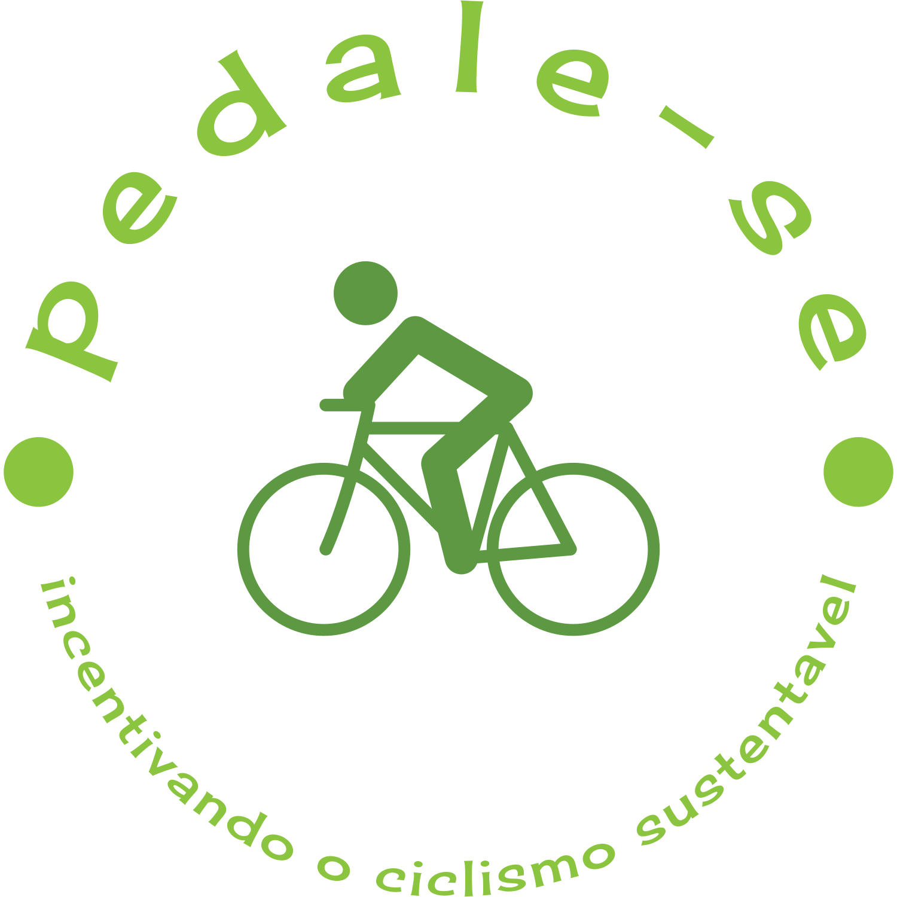
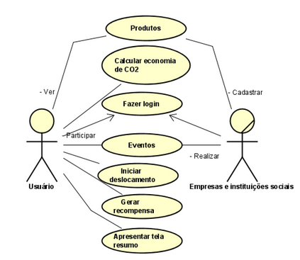

# pedale-se
Pedale-Se: uma proposta de aplicativo para incentivar o ciclismo sustentável.

Projeto da disciplina Atividade Extensionista III do curso de Engenharia da Computação da Escola Superior Politécnica da UNINTER.




Com o objetivo de ajudar a reduzir os impactos ambientais e sociais que são gerados em consequência da emissão excessiva de poluentes. Este projeto busca conscientizar e incentivar a população a utilizar bicicletas como meio de transporte. 

**Palavras-chave**: ciclismo, sustentabilidade; combate à emissão de gases poluentes.

- Para ler a proposta completa, clique [aqui](#Proposta-do-Projeto).

## Principais funcionalidades do aplicativo

- [X] Registro automático do percurso realizado com a bicicleta;
- [X] Ranking de usuários mais ativos;
- [x] Troca de pontos de trajeto por brinde de parceiros.
- [X] Rede social com campeonatos e eventos.
- [X] Registro do CO2 deixado de produzir.

## Tecnologias utilizadas

- **Git/Github**
- **Flutter**

Dependencias:
- **TODO**

## Estrutura do projeto

TODO

```
Pedale-se app
├── s
```

## Instruções gerais 

- *Instalação*

1. Baixe o aplicativo 


## Requisitos funcionais

| ID        | Requisito             | Descrição                          | OBS:                              |
| ------------ | --------------------| -----------------------------------|-----------------------------------|
| 1          | Autenticação do usuário.            | Realizar a Autenticação do usuário. |  |
| 2          | Registro do usuário | Realiza o cadastro do usuário (PF e PJ).|  |
| 3          | Registro de pontuação | Registra a pontuação com base no trajeto. |  |
| 4          |Registro de deslocamentos |Registra os deslocamentos realizados |  |

### Caso de uso e fluxograma

Como atores principais no sistema, identifica-se o usuário principal, pessoa física e as empresas com e sem fins lucrativos. A interação ocorre da forma mostrada no diagrama abaixo, as  empresas vão poder interagir com a classe login e eventos, de formas distintas. Da mesma forma com a classe produtos, onde os usuários poderão conhecer e os empresários vão poder cadastrar.

Diagrama de Caso de Uso


## Proposta do Projeto

As mudanças nos hábitos e principalmente na redução da utilização de veículos automotores tem causado impactos positivos na sociedade e no meio ambiente. Além da maior adoção de estilos de vida saudáveis, destaca-se também que, através da utilização do app PEDALE-SE, a redução dos causadores do efeito estufa, principal vilão do aquecimento global e a redução do sedentarismo, que segundo a OMS atinge cerca de 70% da população mundial. 

Os veículos automotores dominam mais de 70% dos gases que causam o efeito estufa e cada veículo produz uma faixa de 130 a 250 gCO2/km. A população se tornou refém de seus veículos. A super utilização de um meio de transporte poluidor se tornou banal e desnecessário. 

Mesmo para os menores trajetos, onde uma caminhada seria o ideal, o transporte poluidor ainda é utilizado pela maioria da população. De posse de tais observações e embasamento teórico, busca-se despertar a consciência para a adoção de práticas mais saudáveis e sustentáveis, através da prática do ciclismo e do abandono consequente do transporte poluidor. 

Por fim destaca-se também nesse projeto seu caráter social. Durante a realização de eventos, é incentivado aos seus participantes a doação de recursos para ajudar instituições sociais com ênfase em lar de crianças carentes.

## Contribuindo com o projeto

1. Faça o fork do projeto
2. Crie uma branch para sua modificação (git checkout -b feature/any)
3. Faça o commit (git commit -am 'Add some any')
4. Push (git push origin feature/any)
5. Crie um novo Pull Request